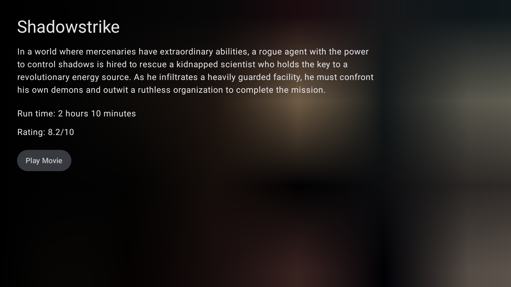
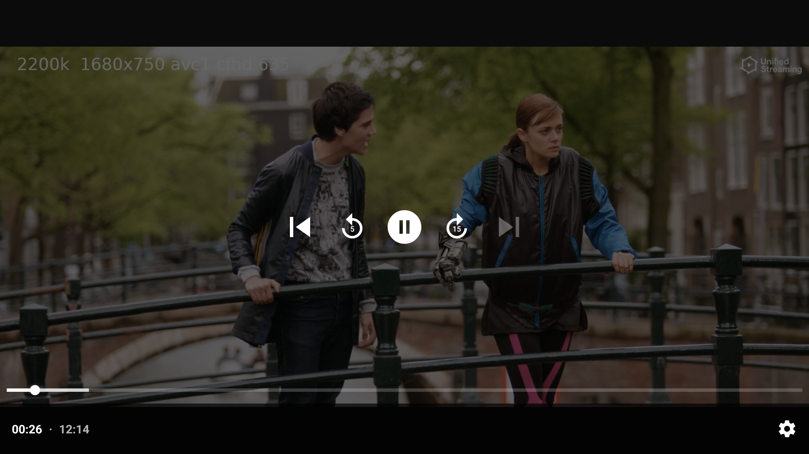

# android-compose-tv-demo
An example Android TV app using Jetpack Compose with Exoplayer & HLS media support. All dependencies are limited to Android Jetpack & Kotlin coroutines and serialization. The app uses a simple MVVM pattern & the data layer retrieves movie info from local storage. 

Jetpack dependencies include:
 - Lifecycle & ViewModel
 - Hilt DI
 - Compose Navigation
 - Compose UI & TV Compose UI
 - Material UI
 - Exoplayer & HLS Media

### Home Screen

### Details Screen

### Video Player
